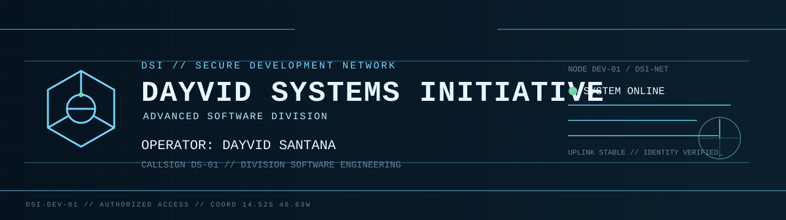
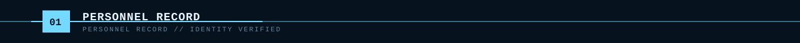
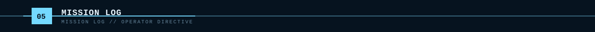
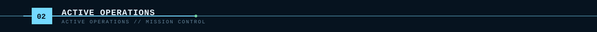
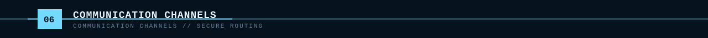

<!-- DSI GitHub Command Center | Autor: Dayvid Santana | Criado/Editado: 28/08/2026 | Objetivo: Renderizar o README de perfil DSI. -->

<!-- DSI:AUTO:START -->

DSI // SECURE DEVELOPMENT NETWORK · NODE DEV-01 · STATUS ACTIVE

**Operator:** Dayvid Santana 
**Callsign:** <code>DS-01</code> 
**Division:** Software Engineering 
**Role:** Software Developer 
**Clearance:** <code>LEVEL 04</code> · **Location:** Brazil

### Building intelligent software systems

Desenvolvedor de software construindo ferramentas, automações, agentes de IA e sistemas escaláveis.

**Focus:** <code>Artificial Intelligence</code> · <code>Developer Tooling</code> · <code>Software Architecture</code> · <code>Automation</code> · <code>Data Engineering</code>
&nbsp;

**OPERATION-001 // DEV-AGENT** — Developer Agent 
Ambiente de desenvolvimento assistido por agentes de IA. 
<code>AI SYSTEM</code> · <code>ACTIVE</code> · Priority <code>HIGH</code>

- **Python** · Backend · <code>OPERATIONAL</code> · 90%
- **FastAPI** · Backend · <code>OPERATIONAL</code> · 80%
- **React** · Frontend · <code>OPERATIONAL</code> · 75%
- **TypeScript** · Frontend · <code>OPERATIONAL</code> · 75%
- **Docker** · Infrastructure · <code>TRAINING</code> · 65%
- **Codex** · Artificial Intelligence · <code>ACTIVE</code> · 80%

Communication channels not configured.
---

DSI-NET // CONNECTION STABLE · ADVANCED SOFTWARE DIVISION

<!-- DSI:AUTO:END -->
